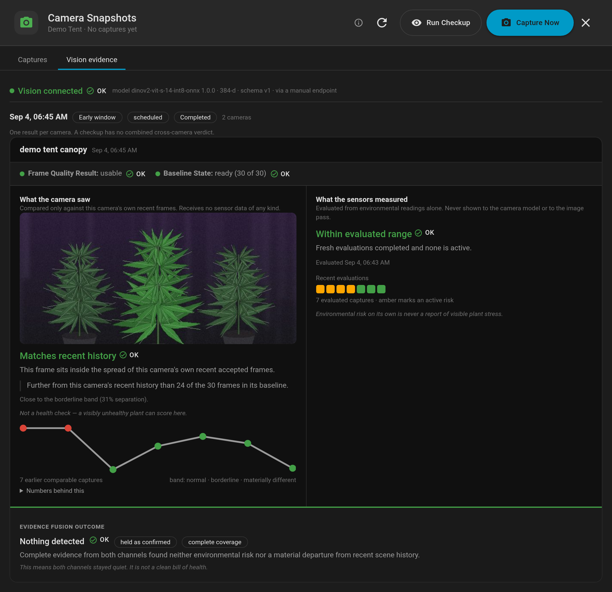
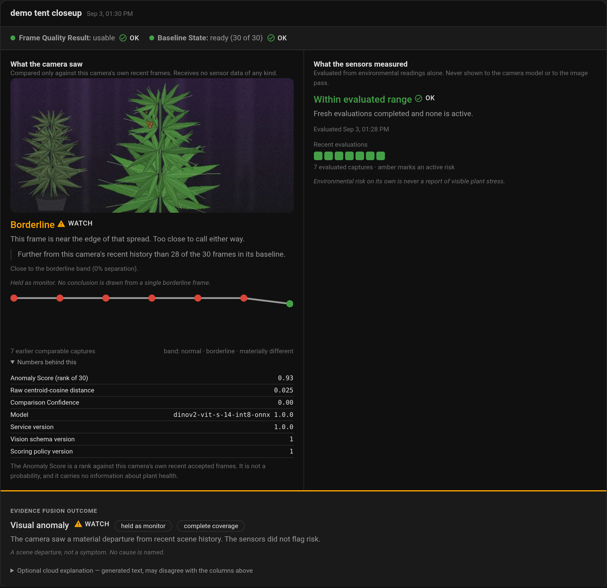
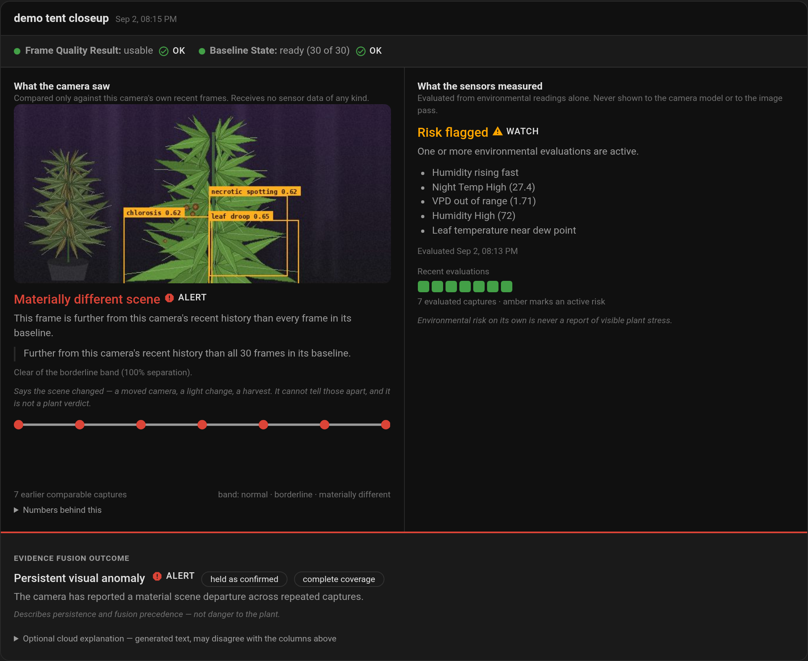
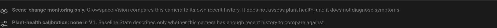

# Growspace Vision

Growspace Vision is the local image-analysis service behind
[Growspace Manager](https://github.com/Venosta-web/growspace_manager)'s Vision
Checkups. Growspace Manager sends it one camera snapshot at a time. For each
snapshot it either rejects the frame as unusable (too dark, too flat,
overexposed) or returns a visual embedding. Growspace Manager then compares that
embedding with the same camera's recent history, so you can tell when a tent
looks materially different from how it has looked lately.

It runs entirely on your own hardware. It makes no internet or cloud request,
needs no GPU, keeps no images, and has no user interface. You see its results
in the Growspace Manager card.

[](https://my.home-assistant.io/redirect/supervisor_add_addon_repository/?repository_url=https%3A%2F%2Fgithub.com%2FVenosta-web%2Fgrowspace_manager_vision)


_The service has no interface of its own; this is Home Assistant's. One Vision
Checkup of the workspace demo tent: a frame the quality gate accepted, the
embedding ranked against that camera's own last thirty frames, and — beside it,
never shown to the model — what the sensors were reading at the time._

- [Requirements](#requirements)
- [Install on Home Assistant OS or Supervised](#install-on-home-assistant-os-or-supervised)
- [Install on Home Assistant Container or Core](#install-on-home-assistant-container-or-core)
- [Turn on Vision Checkups](#turn-on-vision-checkups)
- [What to expect](#what-to-expect)
- [Updating](#updating)
- [Troubleshooting](#troubleshooting)
- [Privacy and security](#privacy-and-security)
- [For developers](#for-developers)

## Requirements

| You need                        | Details                                                                                                                                                                                                                  |
| ------------------------------- | ------------------------------------------------------------------------------------------------------------------------------------------------------------------------------------------------------------------------ |
| Growspace Manager               | **1.2.3 or later**, installed through HACS. Earlier stable releases cannot connect to Vision.                                                                                                                            |
| Growspace Manager card          | Any recent release has the **Vision AI** settings tab. The **Vision evidence** tab shown above is in the `1.4.0` line.                                                                                                   |
| A camera                        | At least one Home Assistant `camera` entity that can see the canopy. Growspace Vision works best with a fixed camera that is not moved.                                                                                  |
| A 64-bit machine                | `amd64` (x86-64) or `aarch64` (for example a Raspberry Pi 4 or 5 running a 64-bit OS). 32-bit ARM is not supported. The `aarch64` image passes an emulated smoke test but has not been benchmarked on real ARM hardware. |
| About 700 MB of disk            | The image contains the model and its complete runtime, and downloads about 200 MB compressed. Nothing else is downloaded after installation.                                                                             |
| Home Assistant OS or Supervised | For the one-click App install below. Home Assistant **Container** and **Core** have no App store; run the same image with Docker instead ([see below](#install-on-home-assistant-container-or-core)).                    |

## Install on Home Assistant OS or Supervised

1. **Add the App repository.** Click the **Add repository** button above. To do
   it by hand, go to **Settings → Apps → Install app**, open the **⋮** menu in
   the top-right corner, choose **Repositories**, and add:

   ```text
   https://github.com/Venosta-web/growspace_manager_vision
   ```

2. **Install Growspace Vision.** It is listed under _Growspace Manager Apps_.
   Growspace Vision is marked **experimental**, so if it is missing from the
   list, turn on **Advanced mode** in your user profile and reload the page.
3. **Start it.** Leave the configuration empty. _Start on boot_ and _Watchdog_
   can stay on.
4. **Check the log.** The App's **Log** tab should include these lines:

   ```text
   [growspace-vision] Bearer token origin: generated
   [growspace-vision] Published the endpoint to Home Assistant as discovery message …
   INFO:     Application startup complete.
   INFO:     Uvicorn running on http://0.0.0.0:8099 (Press CTRL+C to quit)
   ```

   On later starts the first line says `stored` instead of `generated`.

That completes the connection. On first start the App generates its own access
token and gives Home Assistant its address and token through App discovery, so
you have nothing to copy or type. It publishes no port on your host.

To confirm that Growspace Manager can reach it, go to **Settings → Devices &
services → Growspace Manager → Configure → Configure Growspace Vision**, leave
**Connection** on **Automatic**, and submit. Growspace Manager tests the
connection before saving and shows an error if the test fails
([see Troubleshooting](#troubleshooting)).

Next: [turn on Vision Checkups](#turn-on-vision-checkups).

## Install on Home Assistant Container or Core

Without Supervisor there is no App store and no discovery. You run the same
published image yourself and give Growspace Manager its address and a token you
choose.

1. **Generate a token:**

   ```bash
   openssl rand -base64 32
   ```

2. **Start the service** on a machine Home Assistant can reach:

   ```bash
   docker run -d --name growspace-vision --restart unless-stopped \
     --read-only --tmpfs /run:exec --tmpfs /tmp \
     -e GROWSPACE_VISION_TOKEN='paste-your-token-here' \
     -p 8099:8099 \
     ghcr.io/venosta-web/growspace-manager-vision:1.0.1
   ```

   Or, with Docker Compose:

   ```yaml
   services:
     growspace-vision:
       image: ghcr.io/venosta-web/growspace-manager-vision:1.0.1
       restart: unless-stopped
       read_only: true
       tmpfs:
         - /run:exec
         - /tmp
       environment:
         GROWSPACE_VISION_TOKEN: paste-your-token-here
       ports:
         - "8099:8099"
   ```

   The image is multi-architecture, so Docker pulls the right build for your
   machine. Use a specific version tag, not `latest`; the
   [changelog](growspace_vision/CHANGELOG.md) lists the versions.

3. **Check that it is ready:**

   ```bash
   curl http://localhost:8099/health
   ```

   A ready service answers `{"schema_version":1,"status":"ready"}`. The
   container log shows `No Supervisor to announce to; serving the endpoint
directly`, which is expected here.

4. **Connect Growspace Manager.** Go to **Settings → Devices & services →
   Growspace Manager → Configure → Configure Growspace Vision**, set
   **Connection** to **Manual**, and enter:
   - **Endpoint URL**: `http://<host-running-the-container>:8099`. If Home
     Assistant runs in a container on the same Docker network, use the
     container name (`http://growspace-vision:8099`).
   - **Access token**: the token from step 1.

   Growspace Manager tests the connection before saving. In Manual mode it
   never falls back to a discovered App, so a typo appears as an error right
   away and not as silently missing checkups.

> [!IMPORTANT]
> The API is plain HTTP, protected only by the bearer token. Publish port 8099
> only on a network you trust, or bind it to one interface
> (`-p 192.168.1.10:8099:8099`). Never expose it to the internet.

A Supervised or OS install can use Manual mode too: map port `8099/tcp` in the
App's **Network** settings, set your own `access_token` in its configuration,
and enter both in Growspace Manager.

## Turn on Vision Checkups

Growspace Vision only analyses frames that Growspace Manager sends it. Checkups
are switched on per growspace, in the card:

1. Open the growspace's **Settings**: the cog in the card header, or the
   menu on a phone. Then go to **Advanced → Vision AI**.
2. Under **Camera Entities**, pick the cameras that watch this growspace.
3. Tick **Enable automatic vision checkups** and save.

Automatic checkups run three times per light period, timed from the
growspace's lights-on time and its current photoperiod (the flower photoperiod
once a plant in the growspace has started flowering):

| Checkup | Default time                 | Setting                                   |
| ------- | ---------------------------- | ----------------------------------------- |
| Early   | 60 minutes after lights on   | Early check offset (min after lights on)  |
| Mid     | 6 hours into the light cycle | Mid check (hours into light cycle)        |
| Late    | 60 minutes before lights off | Late check offset (min before lights off) |

To run one now, open **Camera Snapshots** from the growspace menu and press
**Run Checkup**, or call the action from an automation:

```yaml
action: growspace_manager.trigger_vision_checkup
data:
  growspace_id: <your growspace id>
```

## What to expect

- **The first month builds a baseline.** A camera's comparisons start once it
  has 30 accepted frames for the same light window, and each window takes at
  most one frame per day. For roughly the first month the evidence tab shows
  the baseline filling up instead of a verdict. This is expected.
- **Rejected frames are normal.** A frame that is too dark, too flat,
  overexposed, or does not match the recorded light state is rejected and
  reported with its reason. It never enters the baseline.
- **It detects scene change, not plant health.** A result says the view has
  departed from its own recent history. A moved camera, a light change, a
  defoliation and a harvest all look the same to it. Vision v1 has no
  plant-health calibration: it cannot tell you that a plant is sick. The
  [Screenshots](#screenshots) section below explains what each part of a
  result means.
- **Keep the camera where it is.** The baseline assumes a fixed view, and v1
  cannot tell a moved camera from a changed scene. There is no control yet to
  restart a camera's baseline, so a camera that has been moved can keep
  reporting a scene change.
- **An AI assistant is optional.** Growspace Manager can have a configured AI
  task explain a result in words (**Configure AI Assistant** in the integration
  options). Growspace Vision does not need it, and the comparison does not
  depend on it.

## Updating

On OS or Supervised, updates appear under **Settings → Apps** like any other
App. On Container or Core, change the image tag and recreate the container.

Updates keep your checkup history. The analysis model has its own version
number, separate from the App version, and your baselines stay comparable as
long as it does not change. A release that changes the model version says so
in the [changelog](growspace_vision/CHANGELOG.md); after such an update,
baselines start again from zero.

## Troubleshooting

| What you see                                                                          | What to do                                                                                                                                                                                                   |
| ------------------------------------------------------------------------------------- | ------------------------------------------------------------------------------------------------------------------------------------------------------------------------------------------------------------ |
| Growspace Vision is not in the App store                                              | Turn on **Advanced mode** in your user profile; experimental Apps are hidden without it. Also check that the repository was added and that your machine is `amd64` or `aarch64`.                             |
| _No Growspace Vision endpoint is available…_                                          | The App is not installed or not running, or it has not published its address yet. Start it and check its log for `Published the endpoint`. On Container or Core, use **Manual**; Automatic needs Supervisor. |
| _Growspace Vision could not be reached at that endpoint._                             | Manual mode: check the URL, the port mapping, and that Home Assistant can reach that host (`curl http://<host>:8099/health` from the Home Assistant machine).                                                |
| _Growspace Vision rejected that access token._                                        | The token in Growspace Manager does not match the service's. Copy it again, with no leading or trailing spaces.                                                                                              |
| _Growspace Vision is running but has no usable model loaded._                         | The bundled model is missing, altered or could not be loaded; the App log says which. Reinstall the App or pull the image again. The service never downloads a replacement model.                            |
| _…supports no analysis schema version this version of Growspace Manager understands._ | Update Growspace Manager and Growspace Vision to current releases.                                                                                                                                           |
| The **Vision AI** tab says to add cameras                                             | Pick at least one camera entity; the checkup options appear once a camera is selected.                                                                                                                       |
| _No cameras configured for this growspace._                                           | The growspace you triggered a checkup for has no camera selected on its **Vision AI** tab.                                                                                                                   |
| Every frame is rejected as `too_dark`                                                 | The camera is capturing while the lights are off, or its exposure is very low. Check the growspace's lights-on time and the camera's night mode.                                                             |

The App's own log (**Settings → Apps → Growspace Vision → Log**) never contains
the token, image data, or file paths, so it is safe to share in an issue.
Report problems in the
[workspace issue tracker](https://github.com/Venosta-web/growspace_manager_workspace/issues).

### Rotating the access token

- **App with a generated token:** delete `/data/bearer_token` from the App's
  storage and restart the App. Growspace Manager picks up the new token by
  itself.
- **App with `access_token` set, or a plain container:** change the value,
  restart, and enter the same value in **Configure Growspace Vision**.

## Privacy and security

- **Local only.** The service makes no network request at runtime. Frames go
  from Home Assistant to the service and nowhere else.
- **Stateless.** It analyses one image and forgets it. Growspace Manager keeps
  the history.
- **Environmental data never reaches the model.** Sensor readings are evaluated
  separately inside Home Assistant, and only the two results are combined.
- **Minimal privileges.** The App requests no host mounts, device access, or
  Home Assistant or Supervisor API permission, and publishes no host port. It
  runs with a read-only root filesystem.
- **Authenticated.** Everything except `GET /health` requires the bearer token,
  and errors never echo tokens, paths, tracebacks or image bytes.
- **Verifiable.** Each image carries an SPDX software bill of materials, the
  licence material of everything it bundles, and a model that is checked
  against a fixed size and SHA-256 at every start.

## Screenshots

A stateless service is hard to photograph, and a user never sees it directly:
they see a checkup come back. These captures are the Growspace Manager card's
**Camera Snapshots → Vision evidence** tab, taken against the workspace hub's dev
instance with the Vision App running and a seeded checkup history behind it — so
every embedding, quality signal and model identity on screen came out of a real
`POST /analyze`. The frames are the demo growspace's rendered tents, never the
private reference corpus. The capture procedure is the hub's
[`docs/SCREENSHOTS.md`](https://github.com/Venosta-web/growspace_manager_workspace/blob/main/docs/SCREENSHOTS.md).

### A comparison too close to call

The service returned one 384-value embedding for this frame and nothing else.
Everything under it is Home Assistant ranking that embedding against the same
camera's own recent accepted frames: 28 of the 30 sit closer, which is a rank
rather than a probability, and the separation from the uncertain band is zero, so
the result is held rather than called. The four provenance rows are what every
result carries — and they are why `service_version` and the wire's
`schema_version` are separate numbers: the thresholds behind this verdict move
with the first and never with the second.



### Two channels that cannot see each other

The left column is all this service contributed: one frame, one embedding, no
sensor data of any kind. The right column is evaluated from environmental
readings alone and never reaches the model or the image pass. Fusing them is
Home Assistant's work, and here it fuses to a persistent visual anomaly — which
says the scene departed from its own recent history across repeated captures, not
that anything is wrong with the plants. A moved camera, a light change and a
harvest all read the same way.



### What a result does not claim

The tab ends on this, and every ledger above carries a caveat of the same kind.
It is the boundary this repository exists to hold. Baseline State says only whether a camera has enough recent
history to be compared against — thirty accepted frames for one camera, light
window, Grow Run, model version and Framing Epoch. It is not evidence that any
alert policy detects a real symptom, which is what
[`CONTEXT.md`](CONTEXT.md) means by Plant-Health Calibration and why V1 has none.
[ADR 0007](docs/adr/0007-production-replay-keeps-an-unintervened-control.md) makes
both lines in this capture permanent presentation, not a placeholder.



## For developers

This repository is the source of truth for the service boundary and its supporting
research:

- [`CONTEXT.md`](CONTEXT.md) defines the shared domain language.
- [`contracts/growspace-vision/v1/`](contracts/growspace-vision/v1/) contains the
  normative OpenAPI 3.1 contract and executable fixtures.
- [`docs/adr/`](docs/adr/) records the accepted boundary and baseline decisions.
- [`docs/research/`](docs/research/) and [`scratchpad/`](scratchpad/) preserve the
  experiments behind those decisions.

The cross-repository roadmap and issue tracker remain in
[`growspace_manager_workspace`](https://github.com/Venosta-web/growspace_manager_workspace).

### Service

The production service is an ASGI application with one public construction seam:
`growspace_vision.create_app`. Its current executable boundary provides:

- unauthenticated readiness at `GET /health`;
- bearer-authenticated `GET /info`, `GET /models`, and `POST /analyze`;
- one process-wide analysis slot with no queue and `429 busy` for concurrent work;
- a ten-second analysis deadline; and
- closed, request-correlated errors that do not expose tokens, paths, tracebacks, image
  bytes, or request metadata.

`POST /analyze` takes one closed `metadata` part and one `image` part advertised and
decoded as JPEG or PNG. It refuses anything else before measuring: a body above 10 MiB
or 24 megapixels is `413 image_too_large`, an unsupported part media type or decoded
format is `415 unsupported_image_format`, and an undecodable body or metadata outside
the contract is `422`. An unknown model identity is also `422 invalid_request`; the
configured model being unavailable is `503 model_not_loaded`. A request must declare
its `Content-Length`; that is the only bound the service can apply before reading a
body.

#### The absolute frame quality floor

Accepted requests are decoded literally — no EXIF orientation, no colour management, no
resampling — and measured for the contract's three `QualitySignals` before any
inference. [ADR 0005](docs/adr/0005-the-frame-quality-gate-rejects-darkness-and-bounds-the-rest.md)
sets the floor this layer applies:

| condition                              | reason                 |
| -------------------------------------- | ---------------------- |
| `mean_luminance < 16`                  | `too_dark`             |
| `mean_absolute_gradient < 0.5`         | `low_detail`           |
| `clipped_pixel_fraction >= 0.90`       | `overexposed`          |
| `light_state` disagrees with the image | `light_state_mismatch` |

A frame reports every floor it fails. A rejection is a first-class `200` result with
`status: "rejected"`, its signals, its reasons, and no embedding — never an error and
never a silent drop — and it costs no inference, which is the whole reason the floor is
absolute. Everything relative to a camera's own past stays in Home Assistant's Quality
History; the service holds no history and applies only the rejections that need none.

These thresholds are service behaviour, not wire shape: they move with
`service_version`, never with `schema_version`.

#### The bundled DINOv2 runtime

The process loads only the local model named by `GROWSPACE_VISION_MODEL_PATH` (default
`/opt/growspace-vision/models/model_int8.onnx`). The checked-in manifest fixes the
`onnx-community/dinov2-small` int8 artifact bytes, model identity, whole-frame
`224 x 168` bicubic preprocessing, ImageNet normalization, CLS-token selection,
384-value output, and float64 L2 normalization. ONNX Runtime 1.29.0 runs with only the
CPU provider, four intra-op threads, one inter-op thread, and full graph optimization.

Startup verifies the artifact's 24,446,700-byte size and SHA-256 before constructing an
ONNX session, then checks the graph's input/output identity. A missing, altered,
unloadable, or incompatible model leaves `/health` unready and `/models` unavailable;
the service never downloads a fallback. Cancellation at the ten-second service
deadline terminates the active ONNX run before the one-slot inference boundary is
released.

Set the per-install token and start one worker on the internal port:

```bash
export GROWSPACE_VISION_TOKEN="replace-with-a-generated-token"
export GROWSPACE_VISION_MODEL_PATH="/path/to/verified/model_int8.onnx"
growspace-vision
```

`GROWSPACE_VISION_SERVICE_VERSION` optionally overrides the reported service release
version. The process deliberately ignores environmental observations; none belongs in
the service configuration or request boundary.

### Home Assistant App images

The [`growspace_vision/config.yaml`](growspace_vision/config.yaml) wrapper exposes only
the internal App-network API. It requests no host mounts, device access, Supervisor or
Home Assistant API permission, Ingress, or published host port.

Because it publishes no host port, the App also owns its own credential.
[`growspace_vision/provision.py`](growspace_vision/provision.py) mints a per-install
bearer token under `/data` on first start and announces `{host, port, token}` to
Supervisor App discovery, which the integration pulls; the optional `access_token`
option overrides it for a manually configured endpoint, and `GROWSPACE_VISION_TOKEN`
overrides both when the image is run outside Supervisor. See
[ADR 0006](docs/adr/0006-the-app-mints-its-own-token-and-hands-it-over-through-discovery.md).

The image build is deliberately split at the network boundary. Preparation downloads
only the URLs in `packaging/locks/{amd64,arm64}.lock`, verifies every size and SHA-256,
and materializes an ignored `.build-inputs/<arch>` directory. Docker then consumes the
exact closed set under `--network none`, installs the dated Debian and hash-complete
wheel closures locally, and bundles the verified model, licence material, notices, and
an architecture-specific SPDX SBOM.

Build and smoke both images:

```bash
./scripts/build-app-images.sh all
```

The smoke gate starts each target architecture with a read-only root filesystem and
`--network none`, checks the architecture from inside the container, then exercises
`/health`, `/info`, `/models`, and a real `/analyze` request. arm64 execution under QEMU
is a compatibility check only; physical ARM latency and memory remain unmeasured.

Home Assistant's current App builder no longer reads `build.yaml`; the pinned
multi-architecture base, build arguments, and labels therefore live directly in the
Dockerfile. [`repository.yaml`](repository.yaml) makes this repository discoverable as
an App repository, while the generic image reference in `config.yaml` is ready for the
separate publication gate.

### Verify the V1 contract

Create an isolated environment, install the service test extra, and run the full suite:

```bash
python3 -m venv .venv
.venv/bin/python -m pip install -e '.[test]'
PYTHONPATH=src .venv/bin/python -m unittest discover -s tests -v
```

The suite never fetches a model. To run the exact-artifact golden and process-startup
tests, prepare the locked bytes separately and provide their local path:

```bash
GROWSPACE_VISION_TEST_MODEL_PATH=/path/to/verified/model_int8.onnx \
  PYTHONPATH=src .venv/bin/python -m unittest discover -s tests -v
```

`tests/test_growspace_vision_contract.py` remains dependency-free when run on its own
with the system Python; the service tests need the installed extra.

### Replay the private reference corpus

[`scripts/private_corpus_replay.py`](scripts/private_corpus_replay.py) drives the 109
local captures through the running production Vision HTTP service, then executes the
Home Assistant integration's production `QualityHistory` and
`VisualComparisonEngine` classes in capture order. It writes the approved filmstrip,
private thumbnails, and the per-frame discrepancy ledger under the ignored
`private-corpus-report/` directory. Embeddings are held only in memory.

Run it with the backend virtual environment so the imported integration modules use
their tested dependency set:

```bash
PYTHONPATH=/path/to/growspace_manager \
  /path/to/growspace_manager/.venv/bin/python scripts/private_corpus_replay.py \
  --corpus "/path/to/private/corpus" \
  --backend-root /path/to/growspace_manager \
  --token-file /path/to/local/options.json
```

The command refuses a partial corpus or extra image files. `aggregate.json` is the one
publishable output: it contains aggregate measurements and provenance, with explicit
privacy flags proving that it contains no source paths, images, embeddings, or
per-frame results. Never commit the report directory itself, even though git ignores
it.
